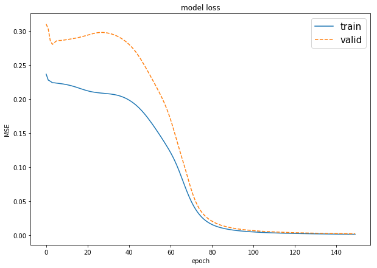
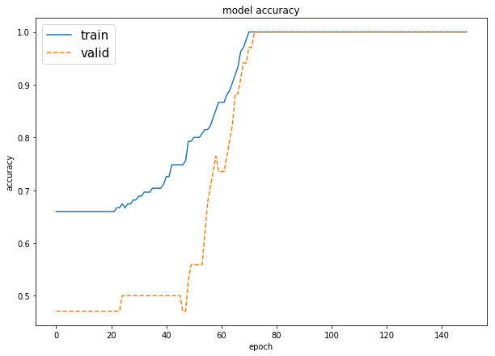
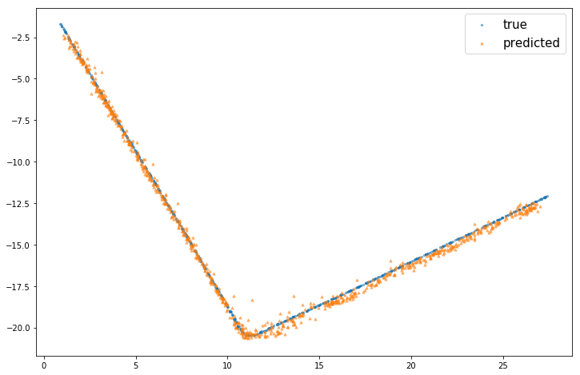

# A Simple Neural Network Implementation

Basic functions for the training and use of a neural network, with a single hidden layer composed of a variable number of nodes, random weights inizialization, L2 regularization and momentum.\
Of course, it is not the most complete experience in term of NN on Python.
Only few parameters to play with, less flexibility, less options. Easier to use ;)

* ```NN_train.py``` contains the actual training functions, for regression and for classification tasks.

* ```NN_tools.py``` contains some useful functions both for the training phase and the visualization of results.

* ```examples_of_usages.ipynb``` contains some case studies for showing the usage of the main functions.

## NN_train.py


* ```train_model_classification(X, y, X_valid=None, y_valid=None, neurons_hidden=5, epochs=500, lr=0.1, reg_lambda=0.0, momentum_alpha=0.0, validation_split = 0.0, threshold=0.5)```\
It return a trained ```model``` for classification, an object that incapsulate all the informations for predicting new values, plot the training intermediate results, and retrieve the hyperparameters used for the training process.\
\
Parameters:

  * ```X``` = the input dataset to be used for training.
  * ```y``` = the vector of target variables.
  * ```X_valid``` = extra dataset used as validation set.
  * ```y_valid``` = vector of target variables for the validation set.
  * ```neurons_hidden``` = number of neurons in the hidden layer.
  * ```epochs``` = for how many iteration the training process will last.
  * ```lr``` = learning rate.
  * ```reg_lambda``` = regularization rate.
  * ```momentum_alpha``` = momentum rate.
  * ```validation_split```= the portion to be extracted from ```X``` for validation purpose (Ignored if ```X_valid``` and ```y_valid``` are not ```None```).
  * ```threshold``` = the thresold that a record need to achieve in order to be classified as positive. It is used during the prediction of values for the accuracy calculation.

* ```train_model_classification(X, y, X_valid=None, y_valid=None, neurons_hidden=5, epochs=500, lr=0.1, reg_lambda=0.0, momentum_alpha=0.0, validation_split = 0.0)```\
The regression version of ```train_model_classification```. Same parameters (except ```threshold```) and same type of object returned\
(*Technical note*: the output nodes here use a linear function instead of the sigmoid as in all the other nodes).

* ```cross_validation(hyperparams, cup_tr_X, cup_tr_y, K_fold)```\
given a value for each hyperparameter to specify, and the number of folds, it returns the average loss values (for the training and validation set, separated), over the different models trained in each fold of the CV. Check the example below.

## NN_tools.py

* ```predict_values(model, X, classification=True)```\
return a numpy array containing the results of the application of the ```X``` dataset to the ```model```. Specifiy if it is a classification task or not, by the last parameter ```classification``` (default = ```True```)

* ```plot_loss_accuracy(model, print_accuracy=True)```\
plot the graphs of the training process, in term of values of the loss function, and the accuracy result only in case of classification task. When the ```model``` is for regression, it must be call with ```print_accuracy=False```

## Examples

### Classification

```python
import pandas as pd
from NN_train import train_model_classification
from NN_train import plot_loss_accuracy

# dataset loading
monks2_train = pd.read_csv("input/monk2_oneofk.train", delimiter = " ", )
monks2_train_x = monks2_train.drop(["target"],axis = 1).values
monks2_train_y = monks2_train["target"].values

# training
monks2_model=train_model_classification(X=monks2_train_x,
                                        y=monks2_train_y,
                                        neurons_hidden=4,
                                        epochs= 150,
                                        momentum_alpha=0.7, 
                                        lr=0.1, reg_lambda=0.0, 
                                        validation_split = 0.2)
# print the graphs
plot_loss_accuracy(monks2_model)
```



### Regression

```python
# dataset loading
list_column = list('input' + str(i) for i in range(1,11))
cup = pd.read_csv("input/ML-CUP17-TR.csv", skiprows=9, names= list_column +(['target_x','target_y']))
cup_X = cup.drop(['target_x','target_y'],axis = 1).values
cup_y = cup[['target_x','target_y']].values
cup_tr_X, cup_ts_X, cup_tr_y, cup_ts_y = train_test_split(cup_X, cup_y, test_size=0.2, shuffle=True)

# training
mlcup_model = train_model_regression(cup_tr_X,
                                     cup_tr_y,
                                     validation_split=0.2,
                                     lr=0.25,
                                     neurons_hidden=16,
                                     momentum_alpha=0.5,
                                     epochs=2000,
                                     reg_lambda=0.001)
# predict values
mlcup_predicted = predict_values(model=mlcup_model, X=cup_tr_X, classification= False)

# useful function for regression tasks with 2-D variable targets.
plot_point_cup( mlcup_predicted, cup_tr_y)
```


### Grid Search & Cross Validation
```python
from itertools import product

# specify the number of folds and the hyperparameters to test
K_fold = 3
lr_list = [0.1, 0.2, 0.3, 0.4]
alpha_list = [0.1, 0.2, 0.3, 0.4, 0.5, 0.6, 0.7, 0.8, 0.9]
lambda_list = [0.001, 0.0015, 0.002]
hyperparams_list = list(product(*[lr_list, alpha_list, lambda_list]))

# itarate over all the combination of hyperparams and obtained the average loss value for every combination, by cross validation
cross_valid_results = []
for hyperparams in hyperparams_list:
    cross_valid_results.append(cross_validation(hyperparams, cup_tr_X, cup_tr_y, K_fold=K_fold))
    print_grid (cross_valid_results[-1])
```
eta: 0.1, alpha: 0.1, lambda: 0.0010; loss (valid): 1.271559; loss (train): 1.190428 

eta: 0.1, alpha: 0.1, lambda: 0.0015; loss (valid): 1.274231; loss (train): 1.195610 

eta: 0.1, alpha: 0.1, lambda: 0.0020; loss (valid): 1.277031; loss (train): 1.200826 

eta: 0.1, alpha: 0.2, lambda: 0.0010; loss (valid): 1.259562; loss (train): 1.175468 

eta: 0.1, alpha: 0.2, lambda: 0.0015; loss (valid): 1.263526; loss (train): 1.181529 

eta: 0.1, alpha: 0.2, lambda: 0.0020; loss (valid): 1.267266; loss (train): 1.188179 

eta: 0.1, alpha: 0.3, lambda: 0.0010; loss (valid): 1.255328; loss (train): 1.164949 

eta: 0.1, alpha: 0.3, lambda: 0.0015; loss (valid): 1.259331; loss (train): 1.172377 

eta: 0.1, alpha: 0.3, lambda: 0.0020; loss (valid): 1.262460; loss (train): 1.179579 
...
```python
# and the winner is...
best_hyperparam_index = np.argmin([x['loss_valid'] for x in cross_valid_results])
print('BEST --->', cross_valid_results[best_hyperparam_index])
```
BEST ---> {'hyperparam': (0.2, 0.8, 0.0015), 'loss_valid': 1.18905974645914, 'loss_train': 1.024073880506817}


## Theory: the Back-propagation algorithm

In this section is briefly explained how the neural network is trained.\
A neural network can be fully rappresented here with his matrices of weights for the hidden layer and the output layer, and the two bias vectors.
So, for each epochs, these four object will be updated in base at the error they do respect to the expected output.

### Notation

<!-- markdownlint-disable MD033 -->
\
\
\
\
\
\
\
\
\
\


### Logistic function used


### Error correction coefficent

\
\


### The correction factor (including regularization and momentum)

\
\


### Updating the weights

\
\


### Updating the bias

\
\

